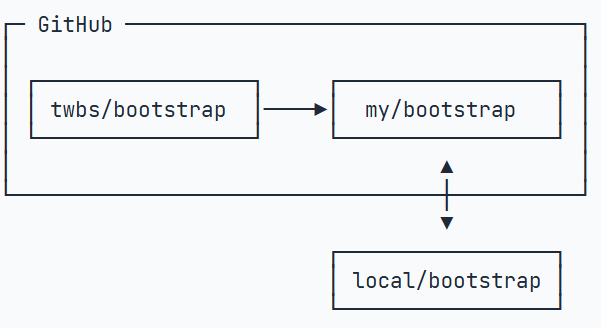

Git is a distributed version control system.
Git is free software distributed under the GPL.
Git has a mutable index called stage.
Git tracks changes.

## install git in Linux
```
git
sudo apt-get install git
git config --global user.name "Your Name"
git config --global user.email "email@example.com"
```

## create repository
```
创建目录 mkdir name
cd name

git init(Initialized empty Git repository in /Users/michael/name/.git/)

新创建的文件要在name目录下或子目录
git add readme.txt
git commit -m "wrote a readme file" (-m后面是本次提交的说明)
```

为什么需要add和commit两步？
```
git add file1.txt
git add file2.txt file3.txt
git commit -m "add 3 files"(add 可添加多次)
```

## change file content
### modify
```
git status(看工作区的状态)

git diff readme.txt(查看修改内容)
或git diff HEAD -- readme.txt

git add readme.txt
git status
git commit -m "add ..."
```
### return to previous version
```
commit 保存版本

git log (查看历史记录) 简介版本： git log --pretty=online

git reset --hard HEAD^(删除了原来版本记录)
(HEAD是当前版本 HEAD^ 上一版本 HEAD^^ 上上一版本 HEAD~100上100版本)
(--hard会回退到上个版本的已提交状态)

git reset --hard 1094a版本号(可找回版本)或 git reflog (查看命令历史)
```
### concept
工作区 版本库=暂存区stage+分支master   add添加到暂存区 commit提交暂存区文件

### cancel change
```
1. git checkout -- readme.txt(文件还没添加到缓存区 直接丢弃工作区修改)

2. git reset HARD readme.txt(把暂存区的修改撤销掉 再步骤1 ) reset既可以回退版本 也可以一把暂存区的修改回退到工作区
```

### remove file
```
rm test.txt(删除文件) 可通过git status看

从版本库里删除文件:
git rm test.txt
git commit -m "remove test.txt"

删错了：
git checkout -- test.txt(用版本库里的版本替换工作区的版本)
```

## remote repository

### SSH Key
```
看主目录下有无.shh文件 若没有则
ssh-keygen -t rsa -C "youremail@example.com" 添加
后在GitHub 里添加id_rsa.pub 里的密钥
```

### add remote repository
从本地到远程
```
先在github上创建仓库
有本地库时 连接远程库：
git remote add origin(给远程库取名) *git@github.com:759761507/LearnGit.git*(远程库SSH地址)

第一次推送 git push -u origin master
后续提交命令：
git push origin master(把本地master分支最新修改推送至GitHub)


删除本地和远程绑定关系：
git remote -v (查看远程库信息)
git remote rm 名字如origin  解除关系并不是物理删除
```
从远程到本地 克隆clone
```
git clone SHH地址

Git支持多种协议如https但ssh协议最快
```
## 分支管理
### 创建合并分支
```
git switch -c <name> (创建并切换到新的分支)
git switch <name> (切换到已有的master分支)

查看分支: git branch
创建分支: git branch <name>

合并某分支到当前分支: git merge<name> (**只改目标分支的改动添加到当前分支**)
删除分支: git branch -d <name>
```
**多个分支相同的地方不一样 手动解决冲突** 
```
git log --graph  看分支合并图

正常是Fast forward模式
git merge --no-ff -m "说明" 分支名 (在合并分支后commit新分支)
```

### fix bug
创建新分支修改bug
```
储存工作现场: git stash
git status 看工作区情况
在哪个分支上修改bug 在哪个分支上创建临时分支 修改完 回来merge

git stash list 查看储存的文件
git stash apply stash@{0} 恢复指定文件 后 git stash drop 删除stash里的文件

修复分支里同样的bug: git cherry-pick <commit>
```

### 添加新功能Feature分支

强行删除 git branch -D <name>  合并完后删除-d


## 标签管理
tag 让人容易记住的commit

```
git tag <name> 在当前打标签 git tag 查看标签
git tag -a <name> -m " "<commit> 在某次commit里打标签  -a名字 -m说明
git show <tagname> 看标签信息
git tag -d <tagname> 删除标签
```
以上标签都在本地

远程标签:
```
git push origin <tagname> 推送一个远程标签
git push origin --tags 推送全部未推送过的本地标签

删除远程标签:
1.先删除本地同上
2.git push origin :refs/tags/<tagname> 删除远程标签

```

## 参与开源项目
在别人网页点fork  后克隆
希望官方修改可以pull request
